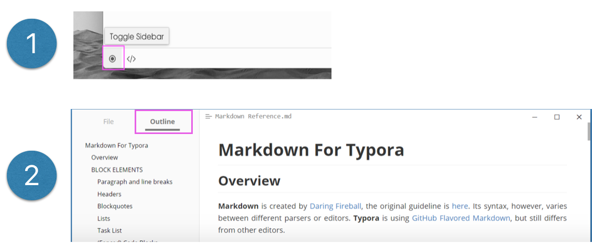
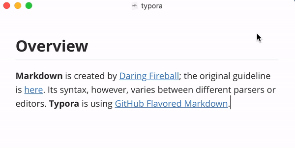
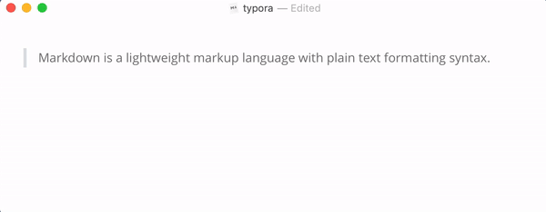
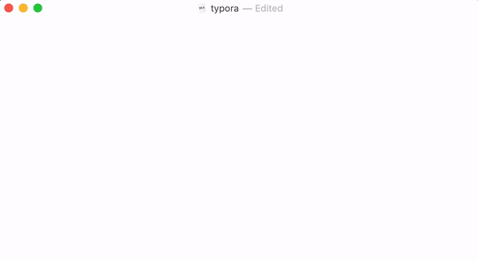
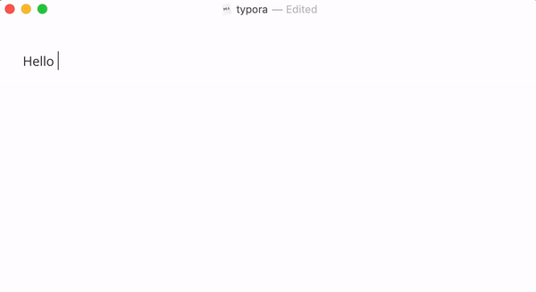
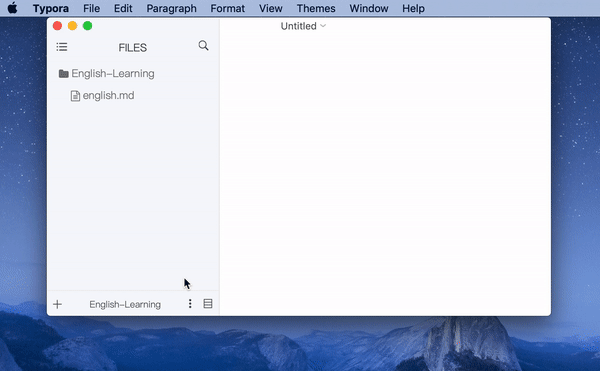
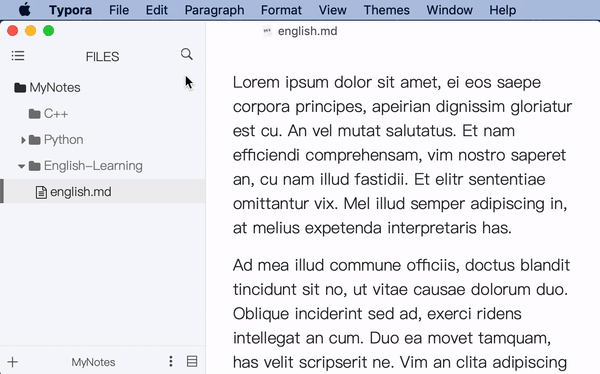
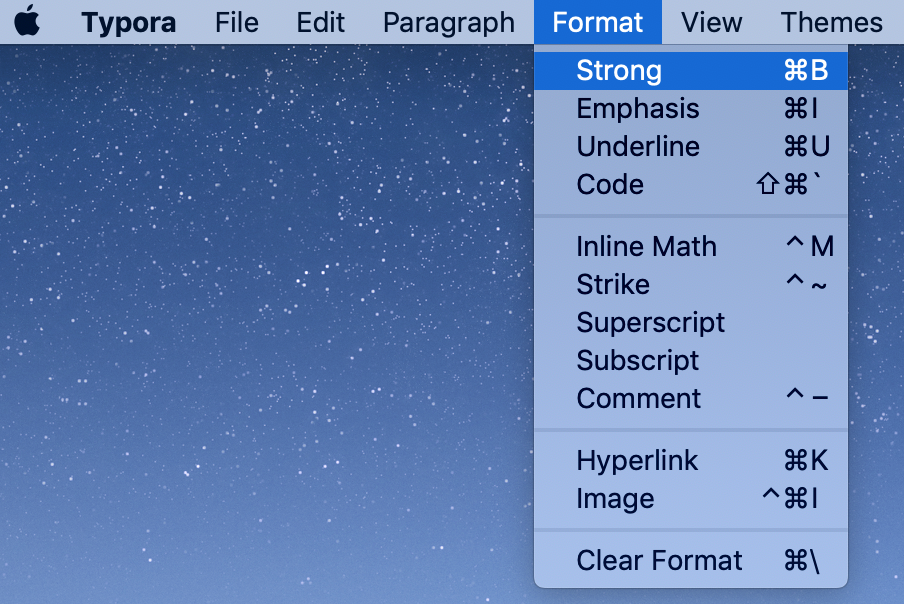

# 前言

1. 为了最大程度地简化**写作**过程，势必要将排版类工作从中分离，交由他人处理。
2. 为了最大程度地简化**交接**过程，势必要建立一套**规则**，用于解释原稿中的标记。
3. 作者在原稿中对特定内容作出标记。
4. 交接的**出版人员**根据规则，对原稿进行排版。


## 概念区分

- `markdown`: [John Gruber](https://en.wikipedia.org/wiki/John_Gruber)设计的一套**规则**（上述2）。
- `typora`: 一款软件，用于原稿创作（上述3）和自动排版（上述4）。

# 教程

- 下载地址: https://typora.io/

- Windows的<kbd>Ctrl</kbd>等价于macOS的<kbd>⌘ Command</kbd>，请根据平台自行替换
- 取消上一次操作(i.e. Undo)：<kbd>⌘ Command</kbd>+<kbd>z</kbd>

## 模式切换

使用<kbd>⌘ Command</kbd>+<kbd>/</kbd>可以在默认模式和原稿模式之间相互**切换**)
- 默认模式: 原稿创作+自动排版。写作过程中符合规则的内容会**立即**排版。（优先推荐👍）
- 原稿模式: 仅原稿创作。写作过程中**不会**出现排版操作。


## 目录视图

- Windows



- macOS


## 段落格式

### 标题

> `typora`以用户定义的各级标题为基准，自动生成目录。(需开启[目录视图](#目录视图))

- <kbd>⌘ Command</kbd>+<kbd>1</kbd>把**当前行**变为一级标题。
- <kbd>⌘ Command</kbd>+<kbd>2</kbd>把**当前行**变为二级标题。
- 以此类推。
- <kbd>⌘ Command</kbd>+<kbd>0</kbd>把**当前行**恢复为普通文字。


### 引用


```markdown
> "To be, or not to be, that is the question"
```
### 脚注



```markdown
> Markdown is a lightweight markup language with plain text formatting syntax.[^1]

[^1]: https://en.wikipedia.org/wiki/Markdown
```

### 无序列表

```markdown
- 牛奶
- 咖啡
```

### 有序列表

```markdown
1. 牛奶
2. 咖啡
```
## 文本格式

### 粗体/斜体/下划线
> 以下快捷键均为`⌘ + 功能首字母`
1. 选中**文字**
2. 执行快捷键（若不选中任何文字, 默认修饰光标最近的单词）
  - `b`old:  <kbd>⌘ Command</kbd>+<kbd>b</kbd>
  - `i`talic: <kbd>⌘ Command</kbd>+<kbd>i</kbd>
  - `u`nderline: <kbd>⌘ Command</kbd>+<kbd>u</kbd>



```markdown
Hello **Typora**
```

### 添加图片

> `markdown`记录的是图片的路径(类似快捷方式)，而不是图片本身。


```markdown

```
### 超链接

> 在使用`typora`的过程中，如需打开文中某一处的超链接，只需按住<kbd>Ctrl</kbd>再点击目标链接，浏览器会自动载入。

1. 复制网址(如`https://typora.io`)
2. 选中**文字**
3. <kbd>⌘ Command</kbd>+<kbd>k</kbd>


```markdown
https://www.wikipedia.org/
[维基百科官网](https://www.wikipedia.org/) 
```

## 可选内容

### 代码块

```markdown
​```python
print("Hello World")
​```
```
### LaTeX


```markdown
$$
\lim_{x\to c}f(x)=L
$$
```
### 局部搜索

搜索范围：当前显示的`markdown`文档的内容

1. <kbd>⌘ Command</kbd>+<kbd>f</kbd> (`f`ind首字母)
2. 输入关键词
3. <kbd>Enter</kbd> 跳到下一处


### 全局搜索


搜索范围：**工作目录**下所有`markdown`文档的内容

1. 定义**工作目录**



2. 搜索


# 更多

> 更多的功能和快捷键请参考**菜单栏**(见下图)，如**Strong**操作对应的快捷键为<kbd>⌘ Command</kbd>+<kbd>b</kbd>。




[^1]: https://support.typora.io/Markdown-Reference